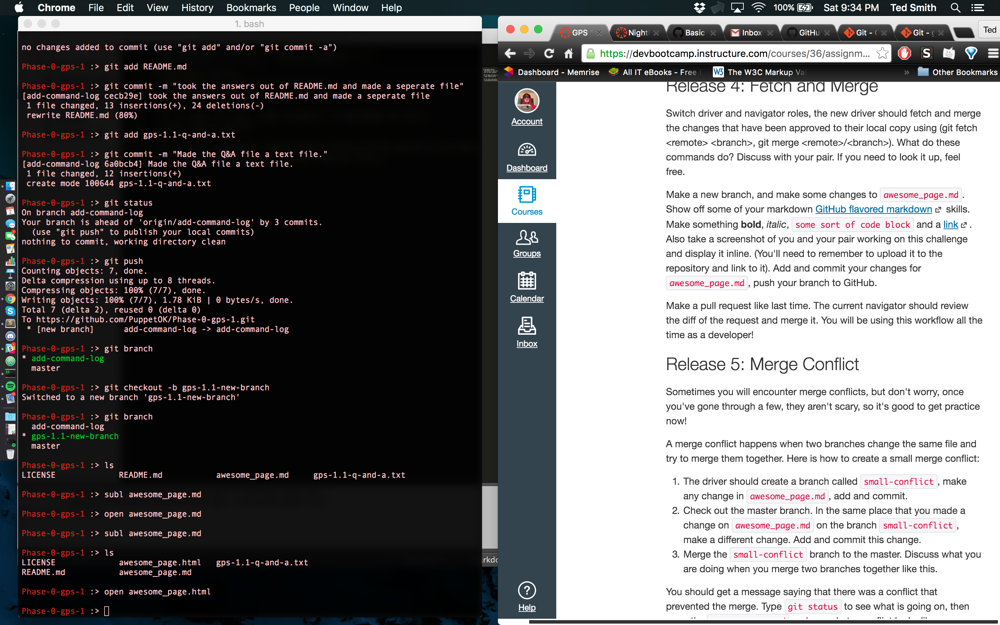

# Markdown Syntax
 **Markdown is very easy to learn**
 *It is very simple*

 It is easy to link `code snippets` in markdown as well.
 `puts "Hello World"`

 It is also extremely [easy](https://help.github.com/articles/basic-writing-and-formatting-syntax/) making links.

Here is a <a href="GPS-1.1-Release.png">screenshot!</a>

 